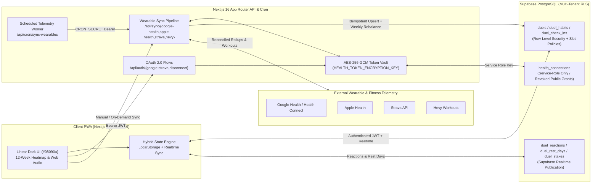

# Do It ⚡

**Multi-Tenant Two-Player Habit Parity, Wearable Telemetry & Accountability Engine**

[](https://do-it-plum-seven.vercel.app)
[-000000?style=flat-square&logo=next.js&logoColor=white)](https://nextjs.org)
[](https://www.typescriptlang.org)
[](https://tailwindcss.com)
[](https://supabase.com)
[](supabase/health.sql)
[](package.json)

> **Live Production App**: [https://do-it-plum-seven.vercel.app](https://do-it-plum-seven.vercel.app)

---

## System Overview

**Do It** is a public, multi-tenant two-player habit competition and accountability platform engineered for high-frequency daily execution. Originating as a calibrated two-player parity engine, the platform enables any pair of users to register accounts, pair via a cryptographic one-use invitation link, and compete in an isolated head-to-head duel.

Unlike conventional habit trackers that treat points as spendable currency or require identical routines, **Do It** enforces **asymmetric habit parity**:
- **Calibrated Equivalent Habits**: Players select from a curated onboarding catalog or define custom habits across 10 domain categories (*Foundation, Gym, Cardio, Intellect, Mind, Deep Work, Skills, Nutrition, Environment, Language*) calibrated to a balanced **240 Daily Par** ceiling and flexible weekly session targets (e.g., *Basketball 3x/wk* vs. *Running 3x/wk*, *Swedish* vs. *Polish*).
- **Decoupled Tiered Leaderboards & Lifetime Karma**: Competitive tallies reset automatically on **Weekly** (Sunday 00:00), **Monthly**, and **Yearly** boundaries to drive recurring head-to-head stakes, while **Lifetime Karma** accumulates permanently as an immutable consistency ledger ([ADR-0001](docs/adr/0001-couples-parity-and-tiered-leaderboards.md)).
- **Mutual Real-World Stakes**: Players wager custom Weekly and Monthly stakes tracked in a persistent *Hall of Champions* ledger without penalizing leaderboard balances.

---

## System Architecture



---

## Architecture & Security Highlights

### 1. Multi-Tenant Duel Isolation via PostgreSQL Row-Level Security
- **Strict Tenant Boundaries (`supabase/duels.sql`, `supabase/duels-extras.sql`)**: Every competitive entity (`duels`, `duel_habits`, `duel_check_ins`, `duel_stakes`, `duel_reactions`, `duel_rest_days`) is partitioned by `duel_id` with PostgreSQL Row-Level Security enabled.
- **Slot-Level Write Enforcement**: Both participants (`owner_id` and `guest_id`) hold `SELECT` visibility across their shared duel to power live head-to-head analytics, while `INSERT`, `UPDATE`, and `DELETE` policies verify `auth.uid()` against the specific `player_slot` (`owner` vs. `guest`) so neither player can mutate their opponent's habits or check-ins.
- **Cryptographic One-Use Invitation Handshake and Profile RPCs**: Duels are provisioned and updated through `SECURITY DEFINER` PostgreSQL functions (`public.create_duel`, `public.accept_duel`, `public.update_duel_player_name`, `public.set_player_color`) with `search_path = ''`; the color RPC validates the caller's slot and Karma threshold before saving.
- **Database-Enforced Idempotency**: A composite unique expression index `duel_check_ins_one_per_habit_day` on `(duel_id, habit_id, (data->>'date'))` prevents rapid repeat taps, network retries, or concurrent wearable sync jobs from awarding duplicate daily points.

### 2. Multi-Provider Wearable & Fitness Sync Pipeline
- **Unified Telemetry Routes**: Server-side synchronization endpoints (`/api/sync/google-health`, `/api/sync/apple-health`, `/api/sync/strava`, `/api/sync/hevy`) and OAuth 2.0 handshakes (`/api/auth/google`, `/api/auth/strava`, `/api/auth/disconnect`) reconcile daily step rollups, sleep intervals, strength workouts, and cardio sessions against active habit automation rules (`src/lib/health-sync.ts`, `src/lib/health-data.ts`).
- **AES-256-GCM Server-Side Token Encryption (`src/lib/health-server.ts`)**: OAuth refresh tokens are never exposed to the browser. Before persistence in `public.health_connections`, tokens are encrypted using Node's `crypto` module (`aes-256-gcm`) with a 12-byte random IV, authenticated tag verification, and a 32-byte server-only key (`HEALTH_TOKEN_ENCRYPTION_KEY`). Furthermore, `supabase/health.sql` revokes all `public`, `anon`, and `authenticated` grants on `health_connections`, restricting access strictly to `service_role`.
- **Timezone-Aware Cron Synchronization (`/api/cron/sync-wearables`)**: A scheduled worker authenticated via `CRON_SECRET` evaluates each connected user's IANA timezone (`Intl.DateTimeFormat`), reconciles both `yesterday` and `today` civil windows to capture delayed wearable uploads, preserves manual check-in precedence, and automatically rebalances weekly target habits (`rebalanceWeeklyHabitCheckIns`).

### 3. Hybrid Offline-First Persistence & Legacy Migration Engine
- **Dual-Mode Storage Seam (`src/lib/duel-sync.ts`, `src/lib/store.tsx`)**: Operates seamlessly as a zero-config offline-first LocalStorage app ([ADR-0002](docs/adr/0002-zero-password-device-profile-identity.md)) and upgrades transparently to a multi-tenant Supabase Realtime duel when authenticated. Paginated batch fetchers (`fetchDuelRows`) and optimistic state reconciliation keep UI interactions instantaneous.
- **Idempotent Migration & Backup Validation (`src/lib/legacy-import.ts`, `src/lib/backup.ts`)**: Includes a deterministic migration planner (`planLegacyReplacement`, `prepareLegacyImport`) that consolidates duplicate historical check-ins by comparing proof attachments, points earned, quantitative progress, and completion timestamps, alongside full JSON backup export/restore with schema validation.

### 4. High-Contrast UI Engineering & Tactile UX
- **Linear-Inspired Dark Interface**: Built on a `#08090a` canvas with `#27272a` hairline borders, responsive desktop sidebar / mobile bottom navigation, and full keyboard navigation (`1`/`2`/`3` tab switching, `?` shortcut modal, `Esc` focus-trapped dialogs).
- **Visual Analytics & Social Proof**: Real-time tug-of-war differential bar, Monday–Sunday daily battle charts, 10-category dominance matrix, 12-week GitHub/Linear-style consistency heatmaps (`HabitHeatmap.tsx`), 12 dynamically evaluated milestone trophies (`TrophyCabinet.tsx`), client-side compressed photo proofs (`image-utils.ts`), and 1-tap cheer reactions (`⚡`, `💪`, `🍕`, `☕`).
- **Indexed Streaks & Calendar Rendering**: Daily streaks use date sets, and weekly streaks index distinct completion dates by ISO week in one history pass before checking consecutive weeks. Rest-day protection and partial-current-week behavior are unchanged. Calendar month labels use static English names, and date labels reuse cached formatters instead of creating one per calendar cell.
- **Synthesized Web Audio & PWA Support**: Zero-asset Web Audio API synthesizer (`sound-utils.ts`) generating tactile check-in clicks and completion fanfare chimes, paired with dynamic PWA manifest generation and URL deep-linking (`?action=checkin&habit=...`) for iOS Shortcuts automation.

---

## Getting Started

### 1. Local Development

```bash
# Install dependencies
npm install

# Start the Next.js 16 (Turbopack) development server
npm run dev
```

Open [http://localhost:3000](http://localhost:3000) in your browser. Without Supabase environment variables configured, the application runs in local offline-first mode.

### 2. Multi-Tenant Supabase & Wearable Setup

1. In your Supabase project's SQL Editor, execute the schema migrations in order:
   - [`supabase/duels.sql`](supabase/duels.sql) — Core multi-tenant tables (`duels`, `duel_habits`, `duel_check_ins`, `duel_stakes`), RLS policies, and `SECURITY DEFINER` invitation RPCs.
     - *Existing deployments*: If you have already executed `duels.sql`, apply [`supabase/replace-solo-duel.sql`](supabase/replace-solo-duel.sql) to enable switching from an unpaired solo duel to an invitation.
   - [`supabase/duels-extras.sql`](supabase/duels-extras.sql) — Realtime reactions, rest-day streak protection, and the idempotent daily check-in unique index.
   - [`supabase/player-colors.sql`](supabase/player-colors.sql) — adds per-player colors to existing and new duels, with an authenticated RPC that enforces lifetime-point unlock thresholds. Apply once after `duels.sql`; existing deployments must run it before players can save colors.
   - [`supabase/health.sql`](supabase/health.sql) — Isolated `health_connections` vault restricted to `service_role`.
2. Copy `.env.example` to `.env.local` and configure your environment variables:
   ```env
   NEXT_PUBLIC_SUPABASE_URL=https://your-project-id.supabase.co
   NEXT_PUBLIC_SUPABASE_ANON_KEY=your-anon-public-key-here

   # Optional: Wearable OAuth & Encrypted Token Vault
   GOOGLE_HEALTH_ENABLED=true
   NEXT_PUBLIC_APP_URL=http://localhost:3000
   GOOGLE_CLIENT_ID=your-google-client-id.apps.googleusercontent.com
   GOOGLE_CLIENT_SECRET=your-google-client-secret
   SUPABASE_SERVICE_ROLE_KEY=your-supabase-service-role-key
   HEALTH_TOKEN_ENCRYPTION_KEY=your-base64-encoded-32-byte-key
   CRON_SECRET=your-secure-cron-secret
   ```
3. Enable Email/Password authentication in Supabase Auth. The first player signs up, creates a duel, and shares the generated one-use invite link from the **Duel** tab; the second player signs in and accepts the invitation to pair accounts.

### 3. Importing Historical Progress & Backups

- **Database Migration**: After signing in and completing habit onboarding, navigate to **Vault → Settings → Bring back previous progress** to merge historical habits and check-ins into your active duel (`src/lib/legacy-import.ts`).
- **JSON Backup Sovereignty**: Export or restore full duel snapshots at any time via **Vault → Settings**. Duplicate check-ins for the same habit and civil date are automatically consolidated.

---

## Verification & Testing

Run the full quality gate (TypeScript strict typechecking, ESLint, and the automated unit/regression test suite covering backup validation, habit catalog parity, health telemetry parsing, image utilities, and idempotent legacy imports) with:

```bash
npm run check
```

Individual commands:
- `npm run typecheck` — `tsc --noEmit`
- `npm run lint` — ESLint 9 static analysis
- `npm test` — Compiles `tsconfig.test.json` and executes the test suite via the Node.js test runner

---

## Architecture Documentation & ADRs

- **Domain Model & Ubiquitous Language**: [`CONTEXT.md`](CONTEXT.md)
- **ADR-0001 — Couples Parity & Tiered Leaderboards with Non-Spendable Karma**: [`docs/adr/0001-couples-parity-and-tiered-leaderboards.md`](docs/adr/0001-couples-parity-and-tiered-leaderboards.md)
- **ADR-0002 — Zero-Password Device-Profile Identity Model**: [`docs/adr/0002-zero-password-device-profile-identity.md`](docs/adr/0002-zero-password-device-profile-identity.md)
- **Wearable & Health Launch Checklist**: [`docs/health-launch.md`](docs/health-launch.md)
- **Low-Friction UX Specification**: [`docs/low-friction-ux.md`](docs/low-friction-ux.md)
- **Agent Issue-to-PR Workflow**: [`docs/agent-workflow.md`](docs/agent-workflow.md)
